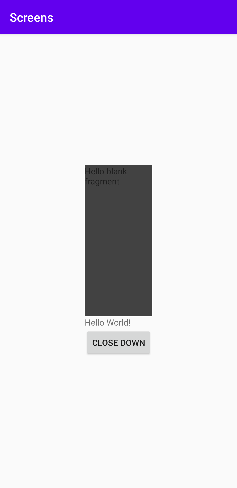
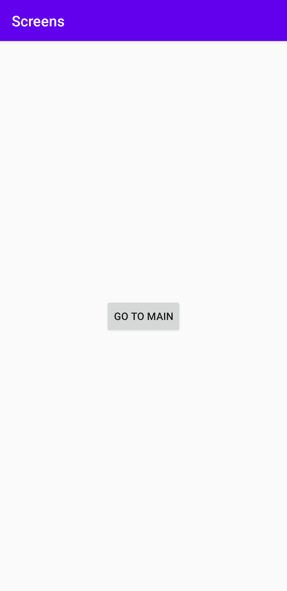

# Rapport screens

**Följande krav med en kortfattad beskrining av hur problemen löstes finns nedanför**

-Fork the app screens and clone the fork from your own Github repository in Android Studio.
Appen screens forkades från LenaSys konto på github. Den öppnades upp via länk genom verisionshanteraren.

-Add a second activity
En ny aktivitet lades till genom file -> new -> activity, den hamnade i javafilerna som en egen fil. En MainActivity fanns från början så den nya aktiviteten blev namngiven till SecondActivity. För att kunna byta aktivietet emellanåt skapades en button i layouten activity second med id _buttonmain_. 
Den fick sitt id eftersom den ska leda till MainActivity.
```
  <Button
        android:id="@+id/buttonmain"
        android:layout_width="wrap_content"
        android:layout_height="wrap_content"
        android:text="Go to main"
        app:layout_constraintBottom_toBottomOf="parent"
        app:layout_constraintLeft_toLeftOf="parent"
        app:layout_constraintRight_toRightOf="parent"
        app:layout_constraintTop_toTopOf="parent" />

```

-Add a button in the first activity that starts the second activity
En button lades till i SecondActivity, koden nedanför säger att SecondActivity ska använda sig av layouten activity_second som finns i layoutfoldern. 
Genom en onclick funktion kan en knapptryckning leda oss till MainActivity. Detta görs både genom en oncklick som lyssnar efter ett klick från användaren samt med hjälp av en intent. 
```
setContentView(R.layout.activity_second);

        Button button = findViewById(R.id.buttonmain);
        button.setOnClickListener(new View.OnClickListener() {
            @Override
            public void onClick(View view) {

                Log.d("LOGIN_SCREEN", "Start activity");

                Intent intent = new Intent(SecondActivity.this, MainActivity.class);


                startActivity(intent);


            }
        });
```

-Add a fragment in the second activity that contains at least one widget
Ett nytt fragment lades till via file -> new -> fragment. Då skapades en ny fil i foldern java samt i layout foldern.
I xml filen som fanns i layout foldern fanns denna kod, det som korrigerades här var elementets bredd och  höjd. Det lades även till en färg på elementet så det skulle kunna visas tydligt på skärmen. 
```
<?xml version="1.0" encoding="utf-8"?>
<FrameLayout xmlns:android="http://schemas.android.com/apk/res/android"
    xmlns:tools="http://schemas.android.com/tools"
    android:layout_width="match_parent"
    android:layout_height="match_parent"
    android:background="@color/cardview_dark_background"
    tools:context=".BlankFragment1">

    <!-- TODO: Update blank fragment layout -->
    <TextView
        android:layout_width="match_parent"
        android:layout_height="match_parent"
        android:text="@string/hello_blank_fragment" />

</FrameLayout>

```

För att få elementet att visualiseras på den virtuella enheten lades detta kodstycket in i aktiviteten activity main. En bredd som matchar elementets förälder som är linear layout lades också till.
```
        <fragment
            android:layout_width="match_parent"
            android:layout_height="250dp"
            android:name="com.example.screens.BlankFragment1"
            android:tag="blank_fragment1"/>
```

_Bilder som inkluderar presentation av en main activity och en second activity_.




